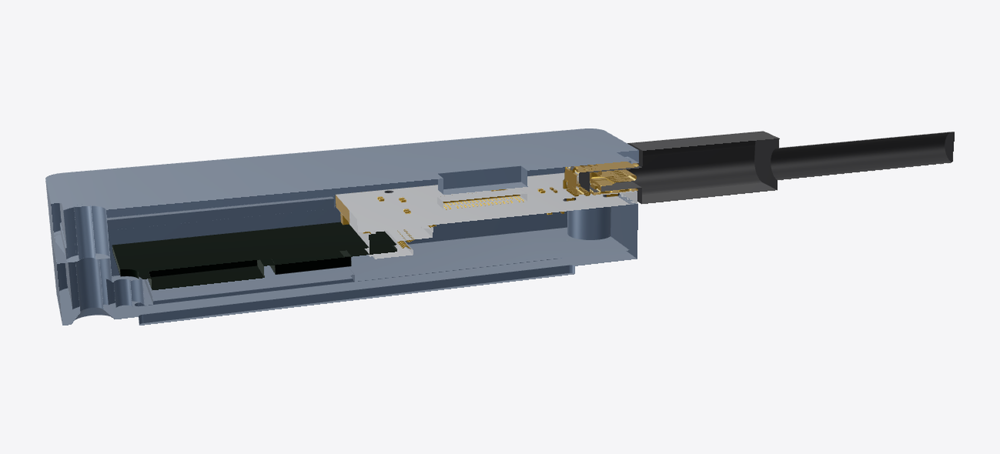
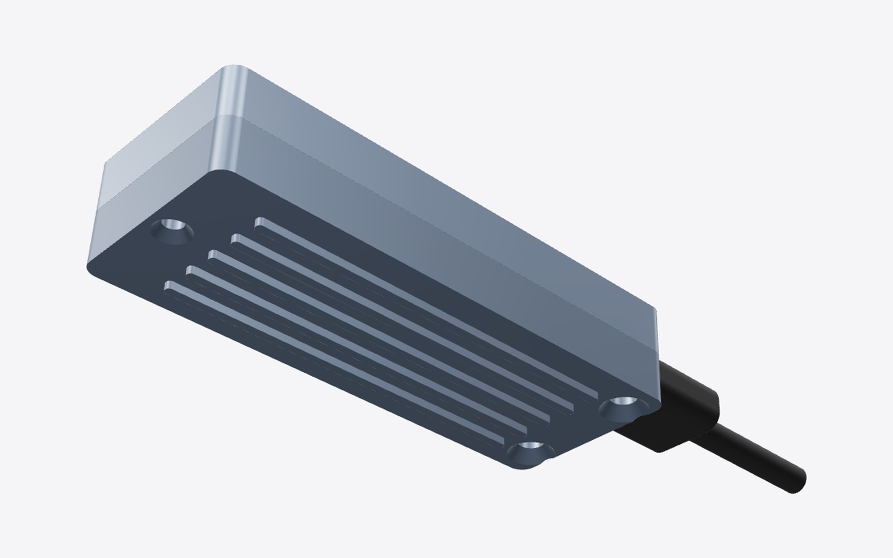
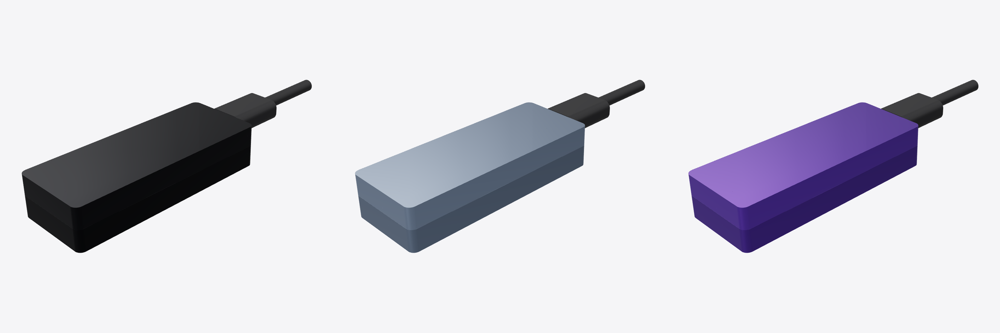
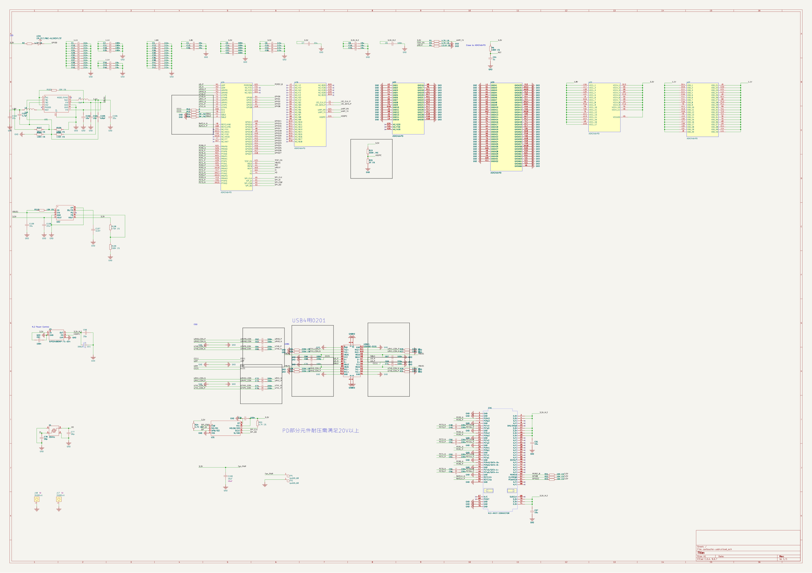

# CARTOUCHE Éclair V1 — a tiny USB4 NVMe drive for a local AI

CARTOUCHE is a way to store heavy AI models and run them easily and fast, while
keeping your data from going to third-party servers.

Website: [cartouche.candygate.eu](https://cartouche.candygate.eu/eclair.html)

| | |
|---|---|
| Board | 22.0 × 33.7 mm, 4 layers, 1.6 mm |
| USB4 controller | ASMedia ASM2464PD, 40 Gb/s, PCIe 4.0 x4 |
| Storage | M.2 2230 NVMe SSD, 256 GB – 2 TB |
| Case | aluminium, 25 × 65.7 × 14.4 mm with the cooling fins, laser-engraved, 3 colours |
| Expected speed | ≈ 3.5 GB/s on USB4 / Thunderbolt, ≈ 1 GB/s on USB 3.2 (not measured yet) |
| In the box | USB-C 40 Gb/s cable + USB-A cable |

| Full model | Inside (case transparent) |
|---|---|
|  |  |
| **Exploded view** | **Board + SSD** |
|  |  |
| **Cut through the middle** | **Underside, M3 screws** |
|  |  |

| PCB, top | PCB, bottom |
|---|---|
|  |  |

## Why I made this

I got the idea because I have a lot of other projects with AI, and this was a real
problem. I like solving the problems I have.

Why my own drive (Éclair) and not just USB keys: because I want it to be useful
for devs and to be a good deal. That's actually why I set up the developer program.

## Wiring

Full schematic: [`pcb/cartouche-usb4.kicad_sch`](pcb/cartouche-usb4.kicad_sch) ·
[PDF](docs/schematic.pdf)

## What's in the repository

| Folder | Content |
|---|---|
| [`BOM.csv`](BOM.csv) | every part, with manufacturer part numbers and supplier links that work from France |
| [`pcb/`](pcb) | KiCad 9 project (`.kicad_pro`, `.kicad_sch`, `.kicad_pcb`, symbol library), Gerbers + drills (`fab/cartouche-usb4-gerbers.zip`), pick-and-place, board STEP, import scripts |
| [`cad/`](cad) | **case source** (`eclair_v1.py`, CadQuery), and in `cad/out/`: case base and lid, SSD 2230 and USB-C plug (STEP + STL), the board as a printable mock-up (STL), and **`eclair_v1_assembly.step`, the full assembly with the electronics** |
| [`firmware/`](firmware) | how the drive enumerates (NVMe over USB4, UAS over USB 3), flashing the ASMedia firmware, `eclair_check.py` (link and speed check) |
| [`docs/`](docs) | [costs per unit](docs/COSTS.md), images |

## The case

The case will be made of good-quality aluminium, both to protect against shocks and
to get rid of the heat. It will be engraved so the info doesn't wear off over time.
Arranging everything as well as possible is pretty complicated. I'm really happy
with it, especially the purple colour of the case, which you can pick as an option
on the website.

| Part | Detail |
|---|---|
| Halves | base + lid, split under the board |
| Board + closing | 2 × M3 × 12 countersunk screws, from below, through the board's Ø3.2 holes into the lid |
| SSD | in the M.2 connector (ARGOSY NASM0-S6701-TPH4, 3.0 mm): card 1.90 mm under the board, edge seated 1.75 mm past the connector posts (datasheet); M2 screw on a standoff of the base |
| Assembly order | plug the SSD into the board outside the case, press it flat, lay board + SSD into the base, M2 screw, then the lid |
| Rear | 1 × M2 × 10 screw |
| USB-C | receptacle flush with the front; plug model included, mated and checked |
| Cooling (passive, no fan) | lid boss + 1 mm thermal pad on the ASM2464PD; base boss + 1 mm thermal pad (20 × 22 mm) under the SSD; 5 fins under the base (1 mm). Leaves232 warns the ASM2464PD overheats and disconnects without cooling (he used a laptop fan): to be checked with a 15 min transfer on the aluminium prototype |
| Interference check | no overlap between board, SSD, plug, base and lid |
| Fit test | print `case_base.stl`, `case_lid.stl`, `ssd_2230.stl`, `board_mockup.stl` (the mock-up has a 1.0 mm card slot cut in the connector); values to confirm are marked `CHECK` in `eclair_v1.py` |
| Fit check (CadQuery) | 0 mm³ overlap between SSD, board, case base, lid and USB-C plug |

## Credit: what is mine and what is not

For this prototype, I'd rather start from something that works, even if I have to
adjust it, than start again from zero (no need to reinvent the wheel). All the
ideas, the tests and the code are my work ;)

| From [Leaves232/2230-USB4-SSD-Enclosure-Design](https://github.com/Leaves232/2230-USB4-SSD-Enclosure-Design) (MIT, see [`LICENSE-upstream-MIT`](LICENSE-upstream-MIT)) | Mine |
|---|---|
| schematic, component placement, USB4/PCIe routing (not modified) | KiCad 9 conversion and fab package, smallest outline, case CAD, SSD and cable fit, BOM with suppliers and costs, flashing procedure and check tool, the CARTOUCHE software |

Schematic imported from the original Altium project into KiCad 9
(`pcb/cartouche-usb4.kicad_sch`, symbols in `pcb/ASM2464PD-altium-import.kicad_sym`).

## How to get it made

| Board parameter | Value |
|---|---|
| Layers / material | 4 layers, FR-4 TG150, 1.6 mm |
| Finish / copper | ENIG, 1 oz outer / 0.5 oz inner |
| Impedance | 85 Ω differential pairs on the outer layers |
| Track / space, vias | 3.5 / 3.5 mil, 0.2 mm tented vias |
| Assembly | by the fab (ASM2464PD = 0.46 mm pitch BGA) |
| Copper zones | do not refill in KiCad (from the tested original) |

1. Order the board assembled (PCBA).
2. Plug the SSD, place the thermal pad.
3. Screw the board and SSD into the base, close the lid.
4. Flash the firmware once ([`firmware/`](firmware)).

## Status

We're working on testing our own Éclair boards, and then, why not, making a sort of
mini computer you plug into your PC that runs the model on its own RAM and its own
storage.

## Licence

MIT, like the original design. See [`LICENSE`](LICENSE) and
[`LICENSE-upstream-MIT`](LICENSE-upstream-MIT).

## Bill of materials

Same content as [`BOM.csv`](BOM.csv).

| # | Qty | Value | Package | Manufacturer | Part number | Unit price | Link |
|---|---|---|---|---|---|---|---|
| 1 | 3 | 22uF | C0402 | Samsung | GRM155R60J226ME11D | CNY 0.22275 | [link](https://www.lcsc.com/search?q=GRM155R60J226ME11D) |
| 2 | 15 | 10uF | C0402 | Samsung | CL05A106MQ5NUNC | CNY 0.02281 | [link](https://www.lcsc.com/search?q=CL05A106MQ5NUNC) |
| 3 | 26 | 2.2uf | C0402 | Samsung | CL05A225KP5NSNC | CNY 0.01346 | [link](https://www.lcsc.com/search?q=CL05A225KP5NSNC) |
| 4 | 16 | 100nF | C0402 | FH | 0402F104M500NT | CNY 0.00481 | [link](https://www.lcsc.com/search?q=0402F104M500NT) |
| 5 | 1 | 1uF | C0402 | FH | 0402X105K6R3NT | CNY 0.00766 | [link](https://www.lcsc.com/search?q=0402X105K6R3NT) |
| 6 | 12 | 220nF | C0201 | Murata | GRM033R60J224ME15D | CNY 0.00917 | [link](https://www.lcsc.com/search?q=GRM033R60J224ME15D) |
| 7 | 1 | 20pF | C0402 | Yageo | CC0402JRNPO9BN200 | CNY 0.00456 | [link](https://www.lcsc.com/search?q=CC0402JRNPO9BN200) |
| 8 | 4 | 330nF | C0201 | Murata | GRM033R60J334ME90D | CNY 0.05114 | [link](https://www.lcsc.com/search?q=GRM033R60J334ME90D) |
| 9 | 2 | 220pF | C0402 | FH | 0402B221K500NT | CNY 0.00433 | [link](https://www.lcsc.com/search?q=0402B221K500NT) |
| 10 | 2 | 30pF | C0402 | FH | 0402CG300J500NT | CNY 0.00454 | [link](https://www.lcsc.com/search?q=0402CG300J500NT) |
| 11 | 1 | 4.7pf | C0402 | FH | 0402CG4R7B500NT | CNY 0.00744 | [link](https://www.lcsc.com/search?q=0402CG4R7B500NT) |
| 12 | 1 | 6.8pf | C0402 | FH | 0402CG6R8C500NT | CNY 0.00420 | [link](https://www.lcsc.com/search?q=0402CG6R8C500NT) |
| 13 | 1 | 33u | C0402 | Murata | GRM155R60J226ME11D | CNY 0.67700 | [link](https://www.lcsc.com/search?q=GRM155R60J226ME11D) |
| 14 | 1 | 3.3nf | C0402 | FH | 0402B332K500NT | CNY 0.00382 | [link](https://www.lcsc.com/search?q=0402B332K500NT) |
| 15 | 1 | 330uF | CAP-SMD_L7.3-W4.3-R-RD | Panasonic | 6TPE330MAP | CNY 2.37008 | [link](https://www.lcsc.com/search?q=6TPE330MAP) |
| 16 | 1 | M.2-MKEY CONNECTOR | CONN-SMD_APCI0113-P001A | ARGOSY | NASM0-S6701-TPH4 | CNY 1.41750 | [link](https://www.lcsc.com/search?q=NASM0-S6701-TPH4) |
| 17 | 2 | 1uh | IND-SMD_L2.0-W1.6-B | cjiang | FTC201610S1R0MBCA | CNY 0.19611 | [link](https://www.lcsc.com/search?q=FTC201610S1R0MBCA) |
| 18 | 1 | 19-217/R6C-AL1M2VY/3T | LED0402-RD | Everlight | 19-217/R6C-AL1M2VY/6T | CNY 0.07979 | [link](https://www.lcsc.com/search?q=19-217/R6C-AL1M2VY/6T) |
| 19 | 5 | 4.7K 1% | R0402 | Uniohm | 0402WGF4701TCE | CNY 0.00219 | [link](https://www.lcsc.com/search?q=0402WGF4701TCE) |
| 20 | 1 | 12.1K 1% | R0402 | Uniohm | 0402WGF1212TCE | CNY 0.00212 | [link](https://www.lcsc.com/search?q=0402WGF1212TCE) |
| 21 | 3 | 100K 1% | R0402 | Uniohm | 0402WGF1003TCE | CNY 0.00200 | [link](https://www.lcsc.com/search?q=0402WGF1003TCE) |
| 22 | 2 | 0 | R0402 | Uniohm | 0402WGF0000TCE | CNY 0.00198 | [link](https://www.lcsc.com/search?q=0402WGF0000TCE) |
| 23 | 1 | 1K 1% | R0402 | Uniohm | 0402WGF1001TCE | CNY 0.00222 | [link](https://www.lcsc.com/search?q=0402WGF1001TCE) |
| 24 | 5 | 10K 1% | R0402 | Uniohm | 0402WGF1002TCE | CNY 0.00216 | [link](https://www.lcsc.com/search?q=0402WGF1002TCE) |
| 25 | 8 | 220K 1% | R0201 | Uniohm | 0201WMF2203TEE | CNY 0.00446 | [link](https://www.lcsc.com/search?q=0201WMF2203TEE) |
| 26 | 1 | 140K 1% | R0402 | Yageo | RC0402FR-07140KL | CNY 0.00279 | [link](https://www.lcsc.com/search?q=RC0402FR-07140KL) |
| 27 | 1 | 261K 1% | R0402 | UniOhm | 0402WGF2613TCE | CNY 0.00216 | [link](https://www.lcsc.com/search?q=0402WGF2613TCE) |
| 28 | 1 | 475K 1% | R0402 | Yageo | RC0402FR-07475KL | CNY 0.00446 | [link](https://www.lcsc.com/search?q=RC0402FR-07475KL) |
| 29 | 1 | 150K 1% | R0402 | Uniohm | 0402WGF1503TCE | CNY 0.00213 | [link](https://www.lcsc.com/search?q=0402WGF1503TCE) |
| 30 | 1 | LTC3315AEV#TRPBF | LQFN-12_L2.0-W2.0-P0.50-TL-EP0.7 | ADI | LTC3315AEV#TRPBF | CNY 16.64280 | [link](https://www.lcsc.com/search?q=LTC3315AEV%23TRPBF) |
| 31 | 1 | ASM2464PD | BGA-273 0.46 mm | ASMedia | ASM2464PD | USD 26.60 (Alibaba, 1-99 pcs) | [link](https://jlcpcb.com/partdetail/Asmedia-ASM2464PD/C7509569) |
| 32 | 1 | TPS82130SILR | USIP-8_L3.0-W2.8-P0.65-TL-EP | TI | TPS82130SILR | CNY 22.94600 | [link](https://www.lcsc.com/search?q=TPS82130SILR) |
| 33 | 1 | SIP32408DNP-T1-GE4 | SIP32408DNP-T1-GE4 | Vishay | SIP32408DNP-T1-GE4 | CNY 4.50360 | [link](https://www.lcsc.com/search?q=SIP32408DNP-T1-GE4) |
| 34 | 1 | ZD25WQ16CEIGR | USON-8_L3.0-W2.0-P0.50-BL-EP | Zetta(澜智) | ZD25WQ16CEIGR | CNY 1.02600 | [link](https://www.lcsc.com/search?q=ZD25WQ16CEIGR) |
| 35 | 1 | 105450-0101 | USB-C-SMD_TYPE-C-USB-18 | Molex | 105450-0101 | CNY 6.32500 | [link](https://www.lcsc.com/search?q=105450-0101) |
| 36 | 1 | 25MHz | CRYSTAL-SMD_4P-L1.6-W1.2-BL | YXC | X322525MSB4SI | CNY 0.29520 | [link](https://www.lcsc.com/search?q=X322525MSB4SI) |
| 37 | 1 | M.2 2230 NVMe SSD, PCIe 4.0, 256 GB – 2 TB | M.2 2230 M-key | Western Digital / Kioxia / Corsair | SN740 / BG6 / MP600 Mini | EUR 30–130 | [link](https://www.amazon.fr/s?k=ssd+m.2+2230+nvme) |
| 38 | 2 | M3 x 12 countersunk (ISO 10642) |  |  |  | ≈ EUR 0.10 | [link](https://www.amazon.fr/s?k=vis+M3+12mm+tete+fraisee) |
| 39 | 1 | M2 x 10 countersunk |  |  |  | ≈ EUR 0.10 | [link](https://www.amazon.fr/s?k=vis+M2+10mm+tete+fraisee) |
| 40 | 1 | M2 x 3 (M.2 SSD screw) |  |  |  | ≈ EUR 0.10 | [link](https://www.amazon.fr/s?k=vis+m.2+ssd+kit) |
| 41 | 1 | 1 mm, ≥ 12 W/mK, cut 10 x 10 mm |  |  |  | ≈ EUR 0.40 | [link](https://www.amazon.fr/s?k=pad+thermique+1mm+12w) |
| 42 | 1 | case_base + case_lid (cad/out) | aluminium CNC anodised, or 3D print for tests |  |  | ≈ EUR 15–35 | [link](https://jlccnc.com) |
| 43 | 1 | USB-C to USB-C, USB4 40 Gb/s, 0.5 m |  | UGREEN or equivalent |  | ≈ EUR 15 | [link](https://www.amazon.fr/s?k=cable+usb4+40gbps+0.5m) |
| 44 | 1 | USB-A to USB-C, 10 Gb/s, 0.5 m |  |  |  | ≈ EUR 10 | [link](https://www.amazon.fr/s?k=cable+usb+a+usb+c+10gbps+0.5m) |
