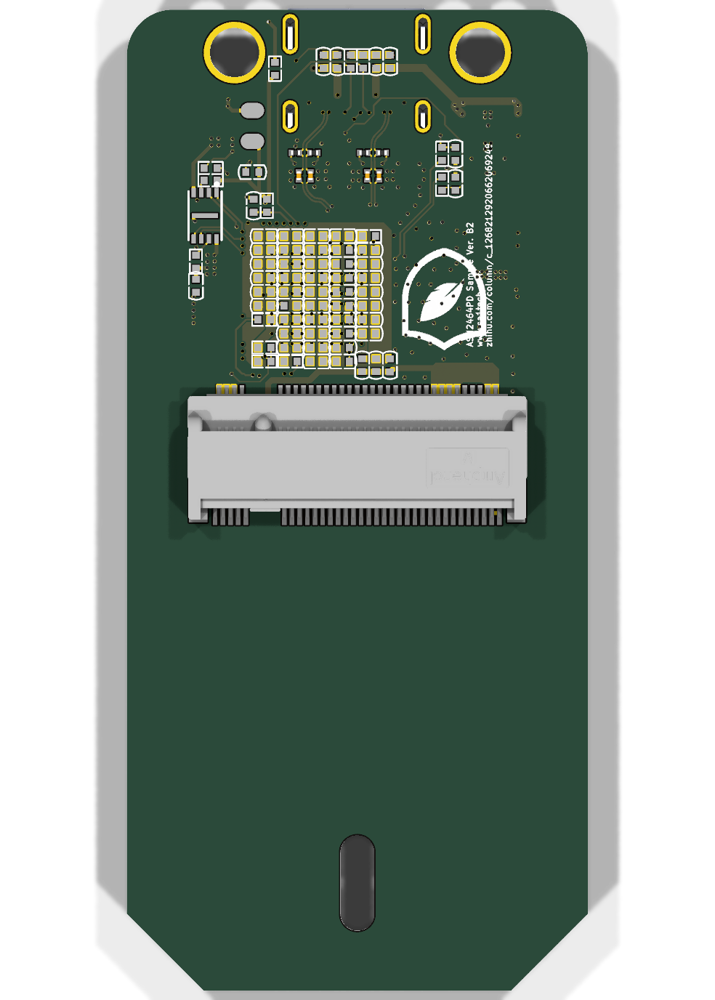

# CARTOUCHE USB4 — a game-cartridge-sized USB4 SSD for a local AI

A small board that turns an **M.2 2230 NVMe SSD** into a **USB4 (40 Gb/s) drive**
in a **30 × 64 mm game-cartridge shape**, with a **single USB-C port**.

It is the hardware for [CARTOUCHE](https://cartouche.candygate.eu): a complete AI
assistant that runs **offline, from the drive itself**. You plug it into any
Windows, macOS or Linux computer, double-click, and chat with an open-source
language model. Nothing is installed on the computer and nothing is sent to the
Internet.

| Top | Bottom |
|---|---|
|  |  |

## Why this board

A local AI reads **billions of bytes** every time it starts: a 3 GB model has to be
read from the drive before the first answer. Today CARTOUCHE ships on USB flash
keys. We measured what that means on the same computer:

| Drive | Read speed | Time to read a 3 GB model |
|---|---|---|
| Ordinary USB key (measured) | 18 MB/s | ~167 s |
| Portable hard drive, Seagate One Touch (measured) | 125 MB/s | ~24 s |
| Best USB flash key we sell, SanDisk (manufacturer figure) | up to 400 MB/s | ~8 s |
| **This board, USB4 + NVMe (expected)** | **~3,500 MB/s** | **< 1 s** |

The larger models (9B–30B parameters, 6–14 GB) are the ones that give really good
answers, and they are exactly the ones that are painful to load from a key. With
USB4 and an NVMe SSD, even a 14 GB model loads in a few seconds, and the drive
still fits in a pocket. The cartridge shape is on purpose: CARTOUCHE means
*cartridge*, you plug your AI in like a game.

## What it is

| | |
|---|---|
| Bridge chip | ASMedia **ASM2464PD** (USB4 40 Gb/s ↔ PCIe 4.0 x4) |
| Storage | M.2 **2230** NVMe SSD, lying under the board, up to **2 TB** (3.3 V power budget) |
| Connector | one USB-C (USB4 / Thunderbolt 3–4, falls back to USB 3.2 and USB 3.0) |
| Expected speed | ~3.5–3.8 GB/s on USB4/Thunderbolt, ~1 GB/s on USB 3.2 10 Gb/s |
| PCB | 4 layers, 1.6 mm, 85 Ω controlled impedance, 3.5 mil tracks, 0.3/0.2 mm vias, ENIG |
| Size | 30 × 64 mm |

## Credit: what is ours and what is not

The electronic core (schematic, USB4/PCIe routing, power supplies) comes from the
open-source project
**[Leaves232/2230-USB4-SSD-Enclosure-Design](https://github.com/Leaves232/2230-USB4-SSD-Enclosure-Design)**
(MIT licence, see [`LICENSE-upstream-MIT`](LICENSE-upstream-MIT)), whose author
built and tested it with a 2 TB Hynix P44 Pro SSD.

For CARTOUCHE we:

- converted the original Altium design to **KiCad 9** (reproducible scripts in [`scripts/`](scripts));
- drew the **30 × 64 mm cartridge outline** around the SSD;
- added a **slot for the M2 screw** so the SSD is held in place, with ±3 mm of play;
- made the **silkscreen** and the **fabrication package** (Gerbers, drill files, pick-and-place, 1:1 template).

The high-speed area (USB4, PCIe) was **not modified**: it is the part that was
proven to work.

## Files

| File | What it is |
|---|---|
| `cartouche-usb4.kicad_pcb`, `.kicad_pro` | KiCad 9 project |
| `fab/cartouche-usb4-gerbers.zip` | Gerbers and drill files, ready for the fab |
| `fab/gerbers/` | the same, unzipped |
| `fab/positions.csv` | component positions (pick and place) |
| `fab/nomenclature-BOM.xlsx` | bill of materials (from the original design) |
| `fab/devis-composants-reference.xlsx` | reference component quote (from the original design) |
| `fab/exigences-fabrication.xlsx` | original fabrication requirements |
| `fab/gabarit-1-1.pdf` | 1:1 outline, print it to check a real SSD fits |
| `scripts/` | Altium → KiCad import and cartridge generation |

## How to get it made

Same settings as the original board (made at Huaqiu / NextPCB):

- 4 layers · FR-4 TG150 · 1.6 mm · ENIG · 1 oz outer / 0.5 oz inner copper
- **controlled impedance: 85 Ω differential pairs on the outer layers**
- tracks/spacing 3.5/3.5 mil · 0.2 mm vias, tented
- **assembly by the fab (PCBA)**: the ASM2464PD is a 0.46 mm pitch BGA, it cannot be soldered by hand

Notes:

- Do **not** refill the copper zones in KiCad (shortcut B): the planes are the ones
  from the original board. The DRC reports 506 "zone isolation 0.5 mm" items and
  solder-mask bridges under the BGA that come from the Altium import, not real
  errors (tracks and pads: 0 errors, 0 unconnected).
- **Cooling is mandatory**: the ASM2464PD needs a thermal pad to the case,
  otherwise it overheats and disconnects.
- A new board must be flashed once with the ASMedia tool and firmware provided in
  the original repository (not redistributed here).

## Status

Designed, not built yet. Next steps: order 5 assembled boards, check the SSD fit
with the 1:1 template, measure real speeds with CARTOUCHE, then design the
aluminium cartridge case (which also acts as the heatsink).

A French version of this README is in [`README.fr.md`](README.fr.md).

## Licence

MIT, like the original design. See [`LICENSE`](LICENSE) and
[`LICENSE-upstream-MIT`](LICENSE-upstream-MIT).
