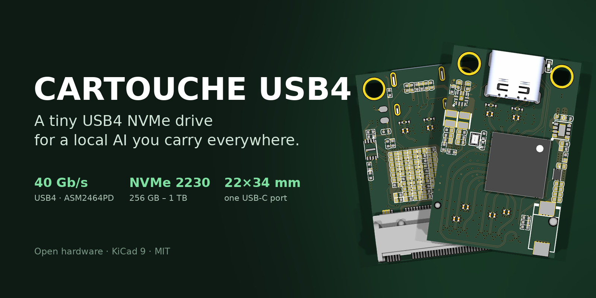
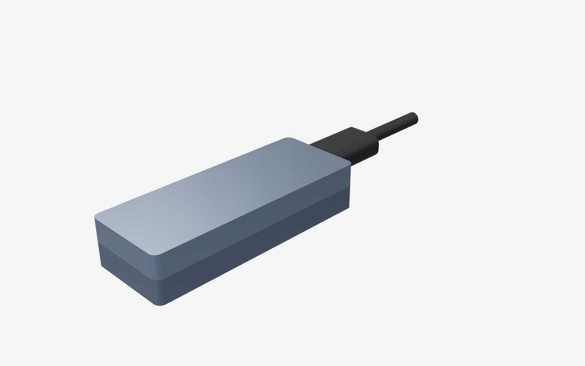
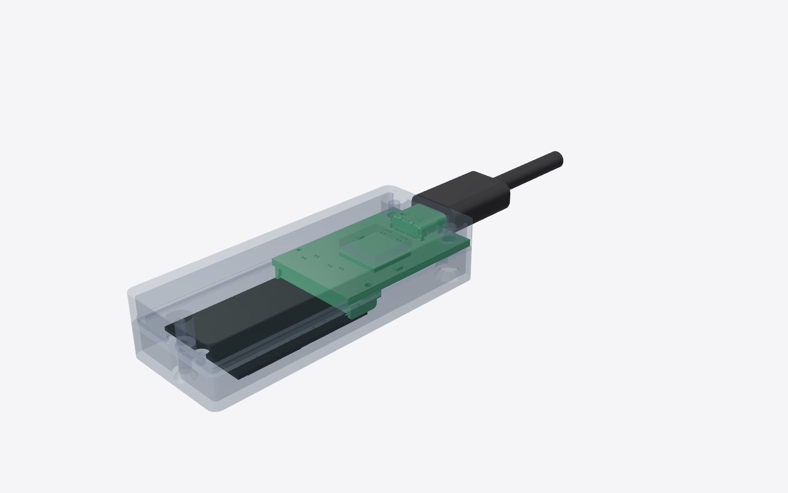
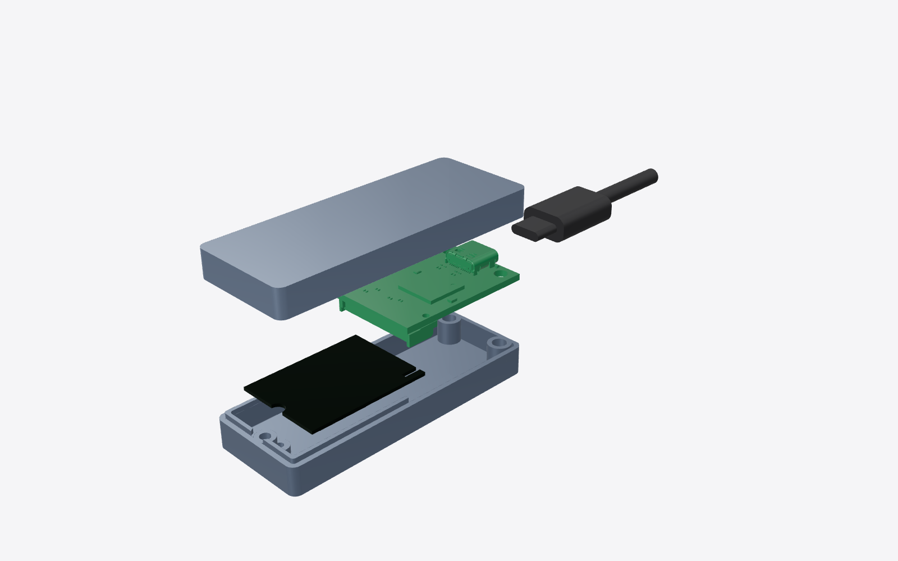
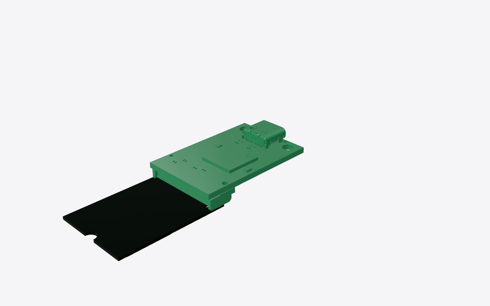
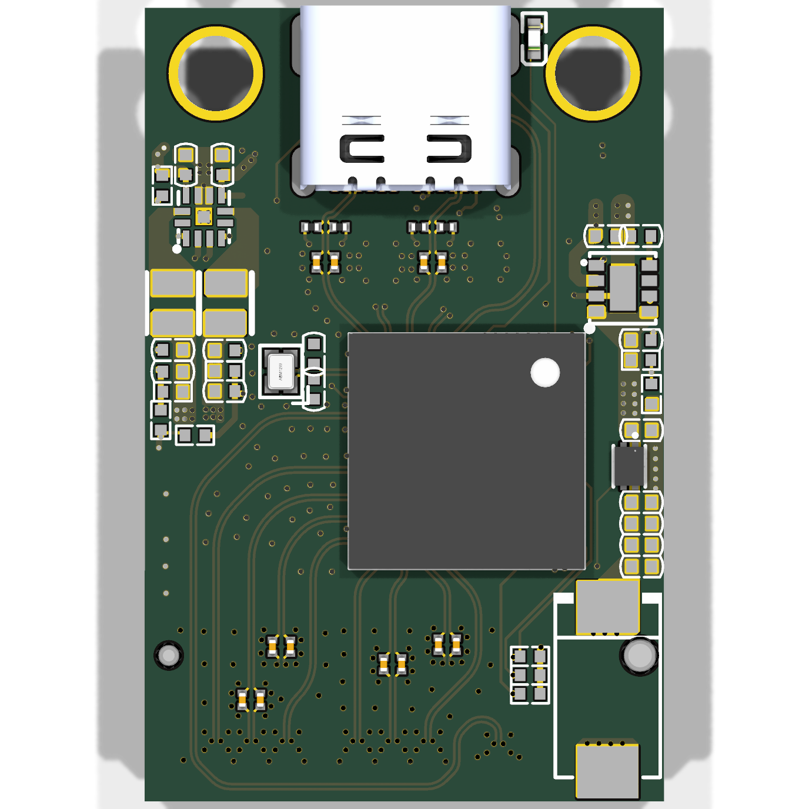
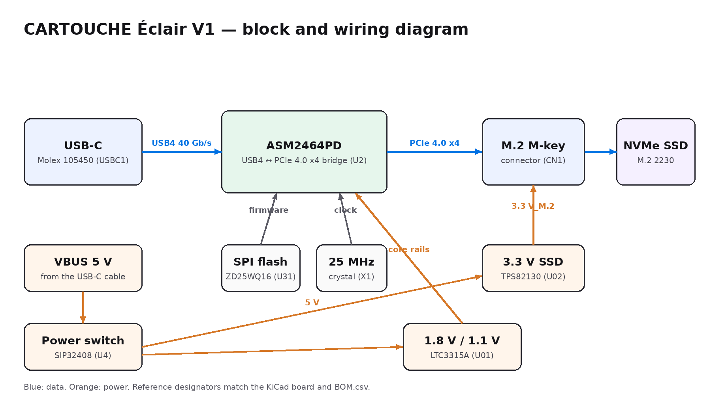

# CARTOUCHE Éclair V1 — a tiny USB4 NVMe drive for a local AI

**CARTOUCHE Éclair V1** is a pocket drive that runs a complete AI assistant offline:
plug it into any Windows, macOS or Linux computer, double-click, chat. Nothing is
installed on the computer and nothing goes to the Internet
([cartouche.candygate.eu](https://cartouche.candygate.eu/eclair.html)).

Inside: a **22.0 × 33.7 mm USB4 board** (ASMedia ASM2464PD, 40 Gb/s), an **M.2 2230
NVMe SSD** (256 GB – 2 TB), in a **25 × 65 × 13 mm aluminium case** with the name
laser-engraved. Local AI reads gigabytes at every start: from a USB key a 3 GB model
takes up to minutes to load, over USB4 + NVMe it should take under a second.

| Full model | Inside (case transparent) |
|---|---|
|  |  |
| **Exploded view** | **Board + SSD** |
|  |  |

| PCB, top | PCB, bottom |
|---|---|
|  |  |

## Wiring

Simplified block diagram; the exact nets are in the original schematic.

## What's in the repository

| Folder | Content |
|---|---|
| [`BOM.csv`](BOM.csv) | every part, with manufacturer part numbers and supplier links that work from France |
| [`pcb/`](pcb) | KiCad 9 project (`.kicad_pro`, `.kicad_pcb`), Gerbers + drills (`fab/cartouche-usb4-gerbers.zip`), pick-and-place, board STEP, import scripts |
| [`cad/`](cad) | **case source** (`eclair_v1.py`, CadQuery), and in `cad/out/`: case base and lid, SSD 2230 and USB-C plug (STEP + STL), the board as a printable mock-up (STL), and **`eclair_v1_assembly.step`, the full assembly with the electronics** |
| [`firmware/`](firmware) | how the drive enumerates (NVMe over USB4, UAS over USB 3), flashing the ASMedia firmware, `eclair_check.py` (link and speed check) |
| [`docs/`](docs) | [costs per unit](docs/COSTS.md), images |

## The case

Everything is modelled at scale around the real board (the KiCad STEP):

- two halves split under the board; the board rests on two posts of the base;
- **two M3 × 12 countersunk screws** go from below through the base, the board's
  Ø3.2 holes, into the lid: one pair of screws holds the board and closes the case;
- the **SSD** lies under the board, plugged in the M.2 connector, held by an **M2
  screw** on a standoff of the base; one M2 × 10 screw closes the rear;
- the **USB-C receptacle is flush** with the front: a real USB-C plug seats fully
  (the plug model is included, mated, and checked for clearance);
- a boss in the lid presses a 1 mm thermal pad on the ASM2464PD (the lid is the
  heatsink);
- interference check: board, SSD, plug, base and lid do not overlap (the SSD edge
  only enters its connector).

To test the fit, print `case_base.stl`, `case_lid.stl`, `ssd_2230.stl` and
`board_mockup.stl`. Values to confirm with the printed test and real parts are
marked `CHECK` in `eclair_v1.py` (SSD insertion depth, screw pilot holes).

## Credit: what is ours and what is not

The board's electronics — schematic, component placement and the hand-routed
USB4/PCIe layout — come from the open-source project
**[Leaves232/2230-USB4-SSD-Enclosure-Design](https://github.com/Leaves232/2230-USB4-SSD-Enclosure-Design)**
(MIT, see [`LICENSE-upstream-MIT`](LICENSE-upstream-MIT)), built and tested by its
author. We did not re-route it: the high-speed layout is the part that is proven.

Ours: the conversion to KiCad 9 and the fabrication package, the choice of the
smallest outline for a closed case, the **case design** (CAD source here), the SSD
and cable fit, the BOM with suppliers and costs, the firmware/flashing procedure
and check tool, and the CARTOUCHE software that runs on it.

The original schematic is in Altium format in the upstream repository; open it in
KiCad with *File → Import → Non-KiCad Project* to get the `.kicad_sch`.

## How to get it made

Board: 4 layers · FR-4 TG150 · **1.6 mm** · ENIG · 1 oz outer / 0.5 oz inner ·
**85 Ω differential pairs** on the outer layers · 3.5/3.5 mil · 0.2 mm tented vias ·
**assembled by the fab** (the ASM2464PD is a 0.46 mm pitch BGA). Do not refill the
copper zones in KiCad (they come from the proven original).

Then: plug the SSD, place the thermal pad, screw the board and SSD into the base,
close the lid, flash the firmware once ([`firmware/`](firmware)).

## Status

Board designed and ready to order; case designed, to be test-printed; not built
yet. Speeds are expected values until measured on the prototype.

A French version of the board notes is in [`README.fr.md`](README.fr.md).

## Licence

MIT, like the original design. See [`LICENSE`](LICENSE) and
[`LICENSE-upstream-MIT`](LICENSE-upstream-MIT).
