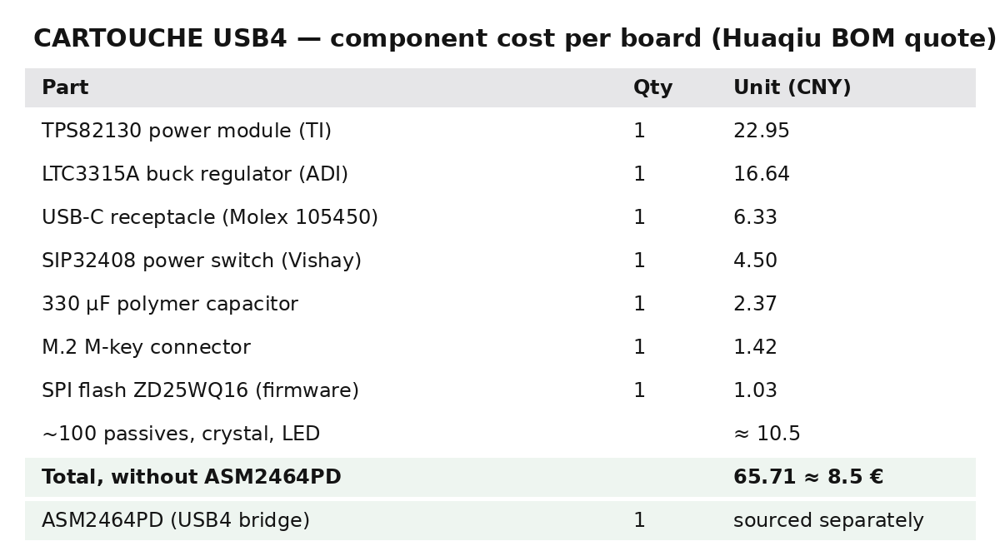

# Cost of one CARTOUCHE Éclair (USB4 drive), per capacity

Each line says where the number comes from. **Real** = a quote or a public
price; **estimate** = our assumption until the supplier quotes it.

## Complete board (PCB + parts + assembly)

| Item | First batch of 10 | Batch of 100 | Source |
|---|---|---|---|
| Parts except the USB4 chip | 8.50 € | 8.50 € | **real**: Huaqiu BOM quote, 65.71 CNY |
| ASM2464PD (USB4 chip) | 24.50 € ($26.60) | 23.60 € ($25.60) | **real**: Alibaba price for 1–99 / 100–499 pcs |
| Bare 4-layer PCB, 22 × 34 mm, controlled impedance | ≈ 12 € | ≈ 2.50 € | estimate (to re-quote with the new Gerbers) |
| Assembly (PCBA, BGA) | ≈ 10 € | ≈ 3 € | estimate (NextPCB advertises a free first assembly) |
| **Complete board** | **≈ 55 €** | **≈ 38 €** | |

## Everything around it

| Item | Batch of 10 | Batch of 100 | Source |
|---|---|---|---|
| Aluminium case, CNC, anodised, laser-engraved | ≈ 35 € | ≈ 15 € | estimate (to quote once the case is drawn) |
| Thermal pad + screws | 1 € | 1 € | estimate |
| USB-A → USB-C cable, 10 Gb/s, 0.5 m (any computer) | 10 € | 10 € | **real**: found by the maker |
| USB-C ↔ USB-C cable, USB4 40 Gb/s, 0.5 m (full speed) | ≈ 15 € | ≈ 15 € | **real** prices seen: 14.90 € (0.5 m), $13.99 (UGREEN 1 m, sale) |
| Box, foam, printed notice | ≈ 3 € | ≈ 3 € | estimate |
| Shipping, Colissimo home delivery, 250 g | 5.49 € | 5.49 € | **real**: La Poste 2026 rate (free for the customer above 59 €) |

## Per capacity: sold at cost

CARTOUCHE is a non-profit project: each price is the unit's cost plus the fees
paid on the sale (card fees ≈ 1.5 % + 0.25 €, the seller's micro-enterprise
social contributions 12.3 %) plus a 5 % reserve for faulty units and returns.
No profit margin. Shipping is charged separately, at cost. The same breakdown
is public on [cartouche.candygate.eu/nos-prix.html](https://cartouche.candygate.eu/nos-prix.html),
computed by `tools/prix_coutant.py` in the software repository.

SSD prices are retail estimates for an M.2 2230 NVMe (2 TB: $120–140 seen).
Costs below are for the first batch of 10.

| Capacity | SSD | Unit cost (incl. box) | Price | Of which reserve |
|---|---|---|---|---|
| 256 GB | ≈ 30 € | 149 € | 184 € | 9.36 € |
| 512 GB | ≈ 45 € | 164 € | 203 € | 10.73 € |
| 1 TB | ≈ 80 € | 199 € | 246 € | 12.80 € |
| 2 TB | ≈ 130 € | 249 € | 307 € | 15.38 € |

With batches of 100 the board and case get cheaper (≈ 38 € and ≈ 15 €), so the
prices will go down by about 45 € per unit.

Not included: one-off costs of the first run (stencil, CNC programming) and the
first prototypes that may need a second revision; these are paid by the project
(for example with a Hack Club Fabricate grant, if approved), not by buyers.

Two cables ship in the box: the USB-A one works on any computer (about 1 GB/s,
the 10 Gb/s USB limit); the USB-C 40 Gb/s one gives full USB4 speed (≈ 3.5 GB/s)
on a USB4 / Thunderbolt port.

## What to buy besides the assembled board

The assembler (NextPCB, turnkey PCBA) buys and solders every part of the BOM
(regulators, USB-C connector, M.2 connector, crystal, flash, passives). Ask them
to source the **ASM2464PD** too: it was missing from the original BOM match. If
they can't, JLCPCB lists it (part C7509569), or buy it on Alibaba ($26.60) and
send it to the assembler (consigned part).

Per drive, bought separately:

| Part | Where | Per drive |
|---|---|---|
| M.2 2230 NVMe SSD (256 GB – 2 TB), e.g. WD SN740, Kioxia BG6, Corsair MP600 Mini | retail | 30–130 € |
| Aluminium case, 2 halves, CNC + anodised + laser-engraved | CNC supplier (from the STEP model) | ≈ 15–35 € |
| Thermal pad 1 mm, ≥ 12 W/mK: cut 10 × 10 mm for the ASM2464PD, 22 × 20 mm for the SSD | one 100 × 100 mm sheet (≈ 10 €) does about 25 drives | ≈ 0.40 € |
| 2 × M3 × 12 countersunk (board + case), 1 × M2 × 10 (rear), 1 × M2 × 3 (SSD) | screw kits (≈ 1–10 €) | ≈ 0.30 € |
| USB-C 40 Gb/s cable + USB-A 10 Gb/s cable | retail | ≈ 25 € |
| Box, foam insert, printed notice | packaging supplier / print shop | ≈ 3 € |

One-off: a Windows PC to flash the ASMedia firmware once per board (free tool
from the original project), and a USB4 or Thunderbolt computer to measure the
real speed.
